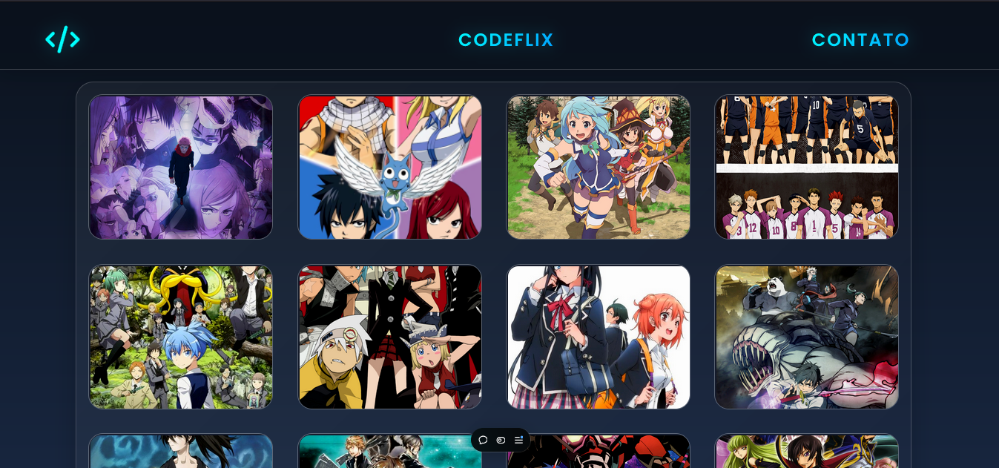
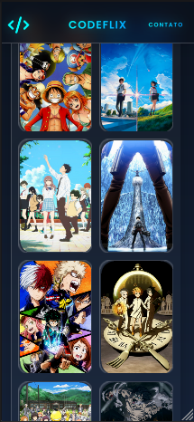

<h1>CodeFlix</h1>

<h3>O Codeflix foi feito com o intuito de ser uma plataforma interativa, que gera de maneira randomizada novos animes na tela, feito por uma REST API, com possibilidade de visualização do trailer</h3>
<h3>Tecnologias utilizadas:</h3>
<ul>
  <li>Svelte</li>
  <li>GRAPHQL APIs</li>
  <li>SCSS</li>
  <li>Vite</li>
  <li>HTML, CSS, JAVASCRIPT</li>
</ul>
